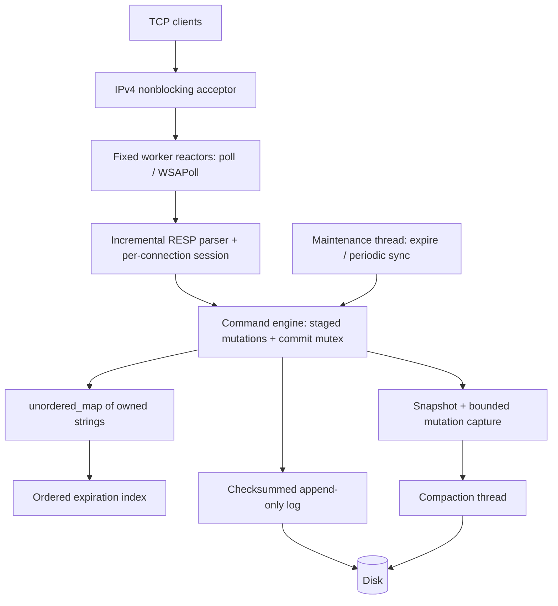

# ForgeDB

A small persistent key-value database server written in C++20. ForgeDB implements
its own string storage engine, incremental TCP protocol parser, indexed expiration,
checksummed append-only log, crash recovery, transactions, and background compaction.
It uses the standard library and native OS APIs; there is no embedded database or
third-party engine behind it.

This project is an exercise in systems engineering: making ownership, serialization,
durability, failure handling, and performance tradeoffs visible enough to explain
at a whiteboard. It is production-style engineering, with the limitations of a
small single-node learning project stated explicitly below.

## Build and try it

Requirements: CMake 3.20+, a C++20 compiler, and Python 3.9+ for process tests.
No packages are downloaded by CMake. Python is not part of the server runtime.

```bash
cmake -S . -B build -DCMAKE_BUILD_TYPE=Release
cmake --build build --parallel 4
ctest --test-dir build --output-on-failure
./build/forgedb-server --data-dir ./data
```

In two other terminals:

```text
$ ./build/forgedb-cli
127.0.0.1:6380> SET user:42 Nishant
OK
127.0.0.1:6380> EXPIRE user:42 60
(integer) 1
127.0.0.1:6380> MULTI
OK
127.0.0.1:6380> INCR counter
QUEUED
127.0.0.1:6380> SET language C++
QUEUED
127.0.0.1:6380> EXEC
1) (integer) 1
2) OK

$ ./build/forgedb-cli GET language
"C++"
```

Windows with Visual Studio C++ Build Tools:

```powershell
python scripts/build.py
.\build\Release\forgedb-server.exe --data-dir .\data
# In a separate terminal:
.\build\Release\forgedb-cli.exe
```

The helper locates bundled CMake and normalizes environment-variable casing for
MSBuild. Alternatively use `cmake -S . -B build -A x64`, then build and test with
`--config Release` / `-C Release`. Stop with Ctrl+C. `--help` lists all arguments.

For a scripted two-client, TTL, counter, forced-crash, transaction, and compaction
demonstration, run `python scripts/demo.py --bin-dir build` (Windows: `build/Release`).
It owns a temporary database and checks every result.

## Implemented commands

| Commands | Behavior |
|---|---|
| `PING [message]` | Health check or echo |
| `SET key value`, `GET key` | Binary-safe strings; SET clears any old TTL |
| `DEL key...`, `EXISTS key...` | Deleted-key count or existing-argument count |
| `MSET key value...`, `MGET key...` | Atomic multi-key updates and consistent reads |
| `INCR key`, `DECR key`, `INCRBY key delta` | Atomic signed 64-bit arithmetic with overflow checks |
| `EXPIRE key seconds`, `TTL key`, `PERSIST key` | Absolute persisted expiration; TTL returns -2 when absent, -1 when persistent |
| `MULTI`, `EXEC`, `DISCARD` | Bounded connection-local queues; atomic execution and one WAL commit |
| `DBSIZE`, `INFO` | Exact live key count; runtime counters and persistence diagnostics |
| `COMPACT` | Start a background AOF rewrite; inspect completion with INFO |

The CLI accepts quoted arguments and backslash escapes. RESP bulk strings are the
binary-safe network interface. `quit` and `exit` leave the interactive CLI.

## Architecture



Each worker owns many sockets, their input/output buffers, and transaction queues.
Accepted connections are assigned round-robin. A worker multiplexes nonblocking I/O
and executes a bounded number of commands per connection per pass. Slow consumers
stop receiving additional work when their output backlog crosses the high-water mark.
No database lock is held during socket reads, writes, or response encoding.

An engine mutex serializes command evaluation and commits across all workers. This
gives atomic counters, consistent MGET, and transaction isolation without lock-order
machinery. It also limits parallel execution: synchronous disk flushes delay other
commands. The choice is intentional and measured, not described as lock-free or
as a sharded engine. See [concurrency](docs/concurrency.md).

## Persistence and recovery

The default policy is **`always`**: append a complete mutation record and synchronize
the file before publishing memory changes or acknowledging success. `everysec` syncs
dirty state on a maintenance schedule; `none` delegates periodic durability to the
OS. Every policy synchronizes on a successful graceful shutdown.

Records have a version magic, bounded payload length, header CRC32, and payload CRC32.
Payloads encode final key states or tombstones, with length-prefixed strings and
absolute Unix-millisecond deadlines. A transaction occupies one record. Recovery
replays complete verified records; a physically incomplete final record is reported
and truncated. A complete corrupt record stops startup and leaves the file untouched.
ForgeDB never searches past corrupt bytes and guesses a new record boundary.

Compaction takes a memory snapshot under the engine lock, writes it on a background
thread, and captures concurrent committed records in a bounded delta buffer. The
final lock appends the delta, syncs the candidate, and atomically replaces the AOF.
If the delta exceeds 32 MiB, that rewrite is cancelled and the original AOF remains
authoritative. Snapshot copying and the final delta/sync do pause commands; the bulk
of snapshot disk I/O does not. Compaction is explicitly triggered by `COMPACT`.

An append/sync failure faults further mutations until restart; a partial write is
never followed by more records. Failed or disconnected requests may have an uncertain
outcome and must not be blindly retried as though exactly-once delivery existed.
See the [format and crash matrix](docs/persistence.md).

## Expiration and transactions

Every TTL key has one node in an ordered deadline index. Lazy lookups remove expired
keys, and the maintenance thread removes up to 256 due entries every 50 ms. Replacing
or cancelling a TTL removes its previous index node, preventing stale-node growth.
`DBSIZE` and `INFO` drain due entries for an exact live count. Wall-clock adjustments
can change observed TTL; absolute time is needed to preserve elapsed time across restart.

MULTI queues commands without executing them. EXEC evaluates the whole queue under
one mutex, using a per-key overlay so later commands see earlier staged values.
Other clients see the state before or after EXEC. Queue errors abort EXEC. Runtime
command errors appear in its result array while successful commands still commit.
Resource-limit failures abort the staged batch. This is deliberately documented
Redis-like behavior, **not rollback-on-any-error or optimistic WATCH semantics**.

## Configuration

| Option | Default | Range / meaning |
|---|---|---|
| `--host` | `127.0.0.1` | IPv4 literal |
| `--port` | `6380` | 1–65535 |
| `--data-dir` | `data` | Exclusive lock prevents two cooperating writers |
| `--worker-threads` | `4` | 1–128 |
| `--max-clients` | `1024` | 1–100000; practical capacity depends on OS/resources |
| `--max-request-size` | `1048576` | 64 bytes–8 MiB, per complete frame |
| `--fsync-policy` | `always` | `always`, `everysec`, `none` |
| `--no-persistence` | off | In-memory mode for comparisons |
| `--run-for-ms` | off | Timed graceful shutdown for tests/profiling; up to one day |

Fixed limits: 4096 arguments/request, 1024 commands and 1 MiB of accounted queued
arguments/transaction, 16 MiB response budget, 16 MiB WAL payload, 32 MiB compaction
delta. INFO reports actual clients, commands, keys, expirations, AOF bytes/syncs,
compactions, background errors, and aggregate lock/execute/AOF timings.

## Verification and measurement

```bash
# Address and undefined behavior sanitizers (GCC/Clang)
cmake -S . -B build-asan -DCMAKE_BUILD_TYPE=RelWithDebInfo \
  -DFORGEDB_SANITIZER=address,undefined
cmake --build build-asan --parallel 4
ASAN_OPTIONS=detect_leaks=1 UBSAN_OPTIONS=halt_on_error=1 \
  ctest --test-dir build-asan --output-on-failure

# ThreadSanitizer must be a separate Linux build
cmake -S . -B build-tsan -DCMAKE_BUILD_TYPE=RelWithDebInfo \
  -DFORGEDB_SANITIZER=thread
cmake --build build-tsan --parallel 4
TSAN_OPTIONS=halt_on_error=1 ctest --test-dir build-tsan --output-on-failure

# Run against a disposable instance: benchmark seeding overwrites bench:* keys
./build/forgedb-benchmark --clients 32 --requests 10000 --command MIXED
python scripts/benchmark.py --bin-dir build --output benchmarks/local-run.json \
  --compiler "your compiler version" --requests 10000 --repeats 3
```

See [tests and sanitizer details](docs/testing.md), [measured benchmarks](docs/benchmarks.md),
and [engineering report](docs/engineering-report.md). Raw measurement JSON is checked
in under `benchmarks/results/`. The benchmark is a closed-loop workload and reports
successful operations/sec, mean/p50/p95/p99 latency, and errors. Measurements are
local observations, not a capacity or latency guarantee.

## Docker and CI

```bash
docker build -t forgedb .
docker run --rm -p 127.0.0.1:6380:6380 -v forgedb-data:/var/lib/forgedb forgedb
```

The image runs as an unprivileged user and runs the test suites during its build.
GitHub Actions defines Linux GCC/Clang, sanitizer, Windows MSVC, and container jobs.
Workflow definitions are included; hosted CI status is only established when run
in a GitHub repository.

## Design tradeoffs and limits

- All live values fit in RAM. There is no total-memory limit, eviction, or disk-backed
  read path; per-connection bounds do not constitute a process memory quota.
- No authentication, TLS, ACLs, or hostile multi-tenant isolation. Bind defaults to
  loopback; deploy only on a trusted network or behind a suitable access boundary.
- One command/commit lock; read-only commands also serialize. Poll is O(connections)
  and a newly assigned socket may wait up to the worker's 20 ms poll interval.
- Snapshot copying uses O(live data) extra memory and a lock-held pause. Final delta
  writing and sync also pause commands. No automatic rewrite policy or retries.
- No replication, pub/sub, clustering, failover, WATCH, extra value types, or Redis
  protocol completeness. The CLI uses IPv4 literals and has no persistent history.
- CRC detects accidental corruption, not tampering. Process-kill tests do not prove
  power-loss guarantees for every filesystem/controller; keep backups of valuable data.
- Default `always` relies on the OS/filesystem/device honoring synchronization. Windows
  lacks the POSIX directory-fsync step used on Linux. Network filesystems and cloud
  synchronization folders are outside the claimed crash-durability model.
- Shutdown completes executing commands, cancels remaining buffered/queued work, and
  closes connections without waiting for slow clients to consume every reply. Clients
  must resolve uncertain outcomes after a disconnect.

Next work with the best return: group commit, bounded total memory, shorter snapshot
pauses, event-driven worker wakeups, and more extensive disk-failure/power-cut testing.
See [architecture](docs/architecture.md) and the [engineering report](docs/engineering-report.md).
