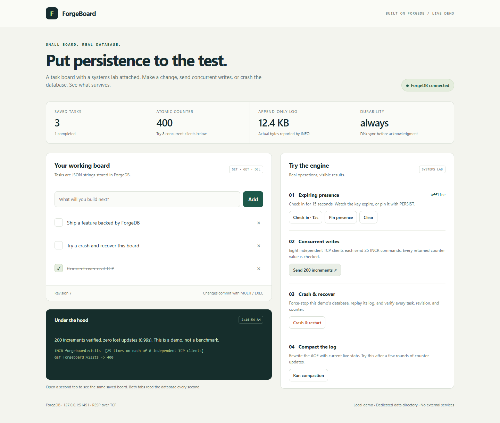

# ForgeBoard

A runnable task dashboard that demonstrates ForgeDB through a real application.
The browser talks to a small Python HTTP bridge; the bridge sends RESP commands
over TCP to a dedicated ForgeDB process. All tasks and counters live in ForgeDB.

No pip packages, Node.js, frontend build, or external services are required.



## Run it

From the repository root, with Python 3.9+, CMake 3.20+, and a C++20 compiler:

```sh
python scripts/build.py
python examples/forgeboard/app.py
```

If ForgeDB is already built, only the second command is needed. The launcher
automatically finds `build/forgedb-server` or the Windows
`build/Release/forgedb-server.exe`. Open **http://127.0.0.1:8080**.
The launcher prints the actual URL and database TCP port.

Use a different build or web port:

```sh
python examples/forgeboard/app.py --bin-dir build/Release --port 8090
```

Ctrl+C stops the application and its database child. Relaunching loads the same
board. Demo data and logs are stored in `examples/forgeboard/.demo-data/`,
which is gitignored. To start a separate board, choose a new dedicated directory:

```sh
python examples/forgeboard/app.py --data-dir examples/forgeboard/.demo-data/another-board
```

The demo always starts its own loopback database on an available port, with
`--fsync-policy always`. It does not attach to your normal ForgeDB instance.

## A five-minute tour

1. **Add and complete a task.** Open another browser tab: both show the same board.
   Task changes and the board revision commit together with MULTI/EXEC.
2. **Check in.** Presence starts with a 15-second TTL. Watch it disappear without
   a delete request. Check in again and click **Pin presence** to remove the TTL.
3. **Send 200 increments.** Eight independent TCP connections each send 25 INCR
   commands. The app checks that all 200 replies are distinct and the counter
   increased by exactly 200. This is a correctness demo, not a benchmark.
4. **Crash & restart.** The launcher force-kills only its own database child,
   starts it with the same AOF, and compares all task values, the revision, and
   the counter before and after. Presence follows its own persisted deadline.
5. **Run compaction.** Try after several counter runs. See the measured AOF byte
   count before and after compaction. Crash again to verify the compacted state.
6. **Delete a task and relaunch.** The deleted task stays deleted. Initial example
   tasks are seeded only when the board index is absent, including when the saved
   index is empty.

The **Under the hood** panel shows the latest action's commands and verified
result. Routine one-second state polling is omitted from this trace. A traffic
run summarizes its 200 repeated commands. Process operations are labeled as such.

## How the application uses ForgeDB

| Feature | ForgeDB operations |
| --- | --- |
| Initial board | MSET of the index, task JSON values, revision, and counter |
| Load board | GET index, MGET task values and counters |
| Add task | MULTI; SET task; SET index; INCR revision; EXEC |
| Complete task | MULTI; SET task; INCR revision; EXEC |
| Delete task | MULTI; DEL task; SET index; INCR revision; EXEC |
| Temporary presence | MULTI; SET presence; EXPIRE presence 15; EXEC |
| Pin / clear presence | PERSIST / DEL |
| Concurrent counter | INCR from eight independent TCP clients |
| Diagnostics / rewrite | INFO / COMPACT |
| Recovery | Force-kill process, replay AOF, compare MGET values |

Keys use the `forgeboard:` prefix. Task values are UTF-8 JSON strings.
A JSON array is the task index because ForgeDB does not provide a key scan or list
type. The task count and completion summary are calculated from persisted tasks.
The AOF size and sync policy come directly from INFO.

```text
Browser (HTML + vanilla JavaScript)
    │ HTTP / JSON, loopback only
Python ThreadingHTTPServer + application service
    │ RESP2 over independent TCP connections
ForgeDB C++ server (fsync=always)
    └── .demo-data/append.aof
```

## Scope and limits

- One Python application instance owns its dedicated database. An application
  lock protects read/modify/write operations on the JSON index; database
  transactions publish related changes atomically. This is not a distributed
  index algorithm or a WATCH implementation. Direct writes from another client
  can violate application invariants.
- The UI supports 100 tasks with titles up to 120 characters. Values are rendered
  as text, including user-supplied HTML. Polling reads live state every second.
- During a demo action, other app requests wait behind the application lock.
  The traffic action still opens eight concurrent database connections.
- Both services bind to loopback. The HTTP bridge validates Host and requires a
  per-launch token for writes. It is a local learning application, with no user
  accounts or production HTTP deployment.
- Commands are never automatically retried after a disconnect: the write may
  already have committed. Refresh before deciding whether to retry.
- A runtime error inside EXEC does not roll back other commands. The client
  reports these errors; the demo uses validated, known key types.
- INFO counters reset on database restart; board data and the AOF persist.
  Compaction need not shrink a log that already contains mostly live data.
- Process termination is a forced stop on Windows, including app exit. With
  `always`, acknowledged writes have been synchronized before the reply.
  A process-crash test is not proof of hardware power-loss durability.

## Tests

```sh
# Linux/macOS
python examples/forgeboard/test_demo.py --server build/forgedb-server
# Windows
python examples/forgeboard/test_demo.py --server build/Release/forgedb-server.exe
```

Eight integration tests exercise the real HTTP API, UTF-8 CRUD, concurrent board
updates, atomic counters, TTL across restart, pinning, invalid inputs, request
guards, AOF compaction, deletion recovery, and repeated launch initialization.
They own a temporary directory and clean up their processes. GitHub Actions runs
the demo tests on Linux and Windows release builds.

Files: `app.py` (HTTP API, board logic, process lifecycle), `forgedb_client.py`
(RESP client), `index.html` (self-contained UI), and `test_demo.py` (integration checks).
